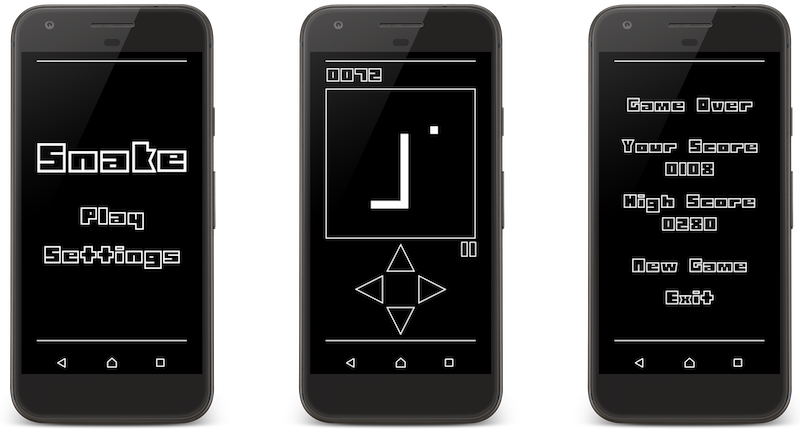

# Snake
[](https://travis-ci.org/vanillaSlice/Snake)

This is a Snake clone written using libGDX.

## Screenshot


## Running the project

### Running the desktop project

```
./gradlew desktop:run
```

This compiles the core and desktop project, and runs the desktop starter.

### Running the Android project

```
./gradlew android:installDebug android:run
```

This task will create a debug APK of the application, install it on the first connected emulator or device and start the
main activity.

## Instructions
Use on screen arrows to control snake (can use arrow keys on desktop).

## Useful Links
Resources useful for the completion of this project:

* [libGDX](https://libgdx.badlogicgames.com/) (cross-platform game development framework)
* [Gradle](https://gradle.org) (for building and dependency management)
* [Music](http://ozzed.net/) (the track used in the game is The Day Time Ran Away by Ozzed)
* [Font](http://www.dafont.com/technolin.font) (the font used in the game is TECHNOLIN created by Haslinda Adnan)
